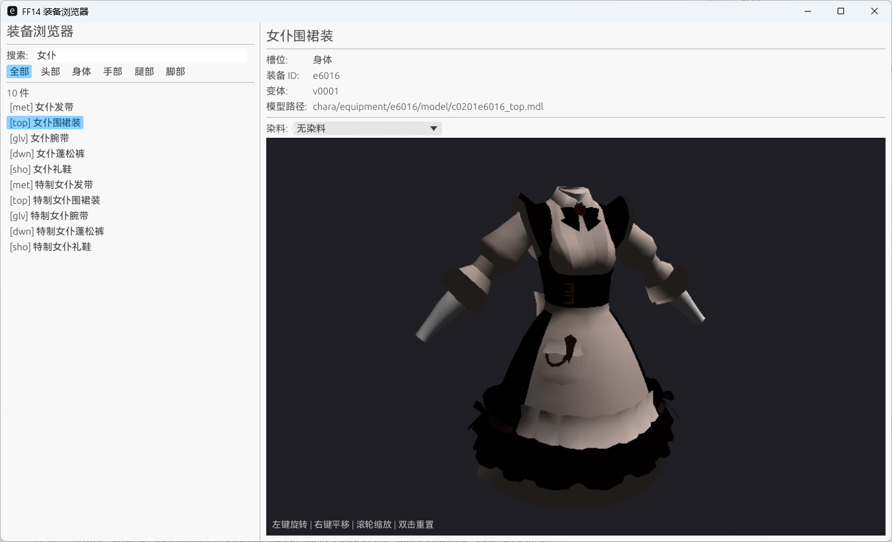

# Tomestone

> **WIP** - 本项目仍处于早期开发阶段，功能和 API 可能随时发生变化。

一个基于 Rust 的 FFXIV 装备模型查看器，支持 3D 渲染预览和染色系统。



## 功能

- 从游戏数据中读取装备列表，按槽位（头部/身体/手部/腿部/脚部）分类浏览
- 加载并渲染装备 3D 模型（MDL）和纹理（TEX）
- 支持 Dawntrail (7.0+) 新格式：ColorTable + `_id.tex` 查表着色
- 染色预览：选择染料实时查看装备颜色变化（基于 STM 染色模板）

## 技术栈

- [eframe](https://github.com/emilk/egui/tree/master/crates/eframe) / [egui](https://github.com/emilk/egui) - UI 框架
- [wgpu](https://github.com/gfx-rs/wgpu) - GPU 渲染
- [physis](https://github.com/redstrate/Physis) - FFXIV 游戏数据解析

## Roadmap

目前仅支持装备的基础渲染和染色预览。后续可能会完善渲染效果（法线贴图、光照、PBR 材质等），扩展到配饰、武器、家具、坐骑和宠物的模型预览，以及支持多部位角色模型组装。更远的想法是做一个插件来和 FFXIV 游戏本体交互，比如幻化图鉴同步之类的。

## 构建

需要安装 Rust 工具链。

```bash
cargo build --release
```

---

<details>
<summary>English</summary>

# Tomestone

> **WIP** — This project is in early development. Features and APIs are subject to change.

A Rust-based FFXIV equipment model viewer with 3D rendering and dye system support.


## Features

- Browse equipment list from game data, filtered by slot (head / body / gloves / legs / feet)
- Load and render 3D equipment models (MDL) with textures (TEX)
- Dawntrail (7.0+) support: ColorTable + `_id.tex` lookup-based coloring
- Dye preview: select a stain and see real-time color changes (powered by STM staining templates)

## Tech Stack

- [eframe](https://github.com/emilk/egui/tree/master/crates/eframe) / [egui](https://github.com/emilk/egui) — UI framework
- [wgpu](https://github.com/gfx-rs/wgpu) — GPU rendering
- [physis](https://github.com/redstrate/Physis) — FFXIV game data parsing

## Roadmap

Currently only basic equipment rendering and dye preview are supported. Future plans may include better rendering (normal maps, lighting, PBR materials), extending to accessories, weapons, furniture, mounts and minions, as well as multi-slot character model assembly. A more ambitious idea would be a plugin for interacting with the FFXIV game client itself, such as glamour dresser synchronization.

## Build

Requires Rust toolchain.

```bash
cargo build --release
```

</details>
